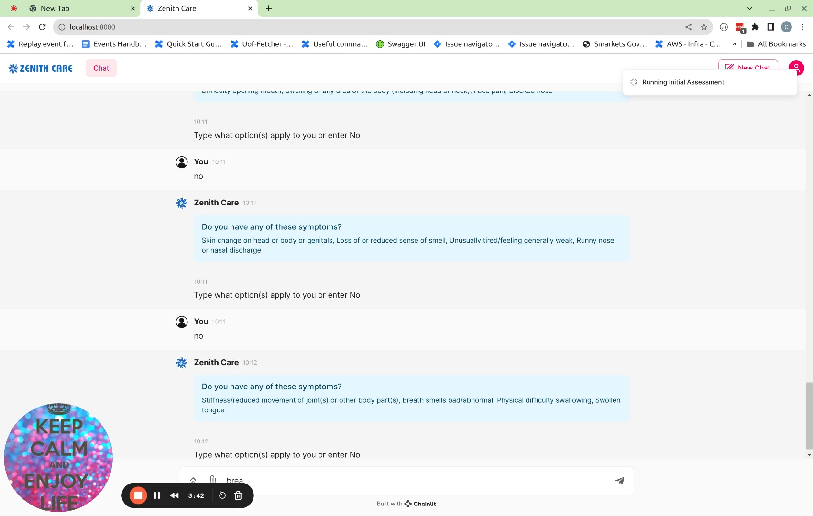

# Zenith Care
Encode AI Hackathon

## Overview
This project was developed as part of the Encode AI Hackathon. It is an AI chatbot tool aimed at improving communication between A&E visitors and healthcare professionals. By enabling patients to present their case with precise, succinct data, we're streamlining decision-making for safer, more effective care.

## Technical Details
- **Stack**: Python, Healthily API, Chainlit
- **File Structure**:
  - `healthily.py`: Healthily API methods.
  - `utils.py`: Contains utility functions.
  - `layout.py`: Contains the frontend code and connects UI with the backend.
  - Frontend assets:
    - `favicon.png`
    - `logo_light.png`
    - `user_icon.png`
  - `requirements.txt`: Contains the requirements required to be installed in the environment to successfully run the application.

## Functionality
The application provides a user interaction flow, where users enter information based on the chatbot questions. These answers are then used to generate a consultation report which can be downloaded as a .pdf file to be used as a reference document at the A&E centers.

## Demo

[Watch the Demo](https://www.loom.com/share/02a9282595a94166ac98ddfdcd24a328?sid=e5931e90-89b6-4699-bd2b-0fad6197affd)

(https://www.loom.com/share/02a9282595a94166ac98ddfdcd24a328?sid=e5931e90-89b6-4699-bd2b-0fad6197affd)

## Installation
1. Clone this repository.
2. Set up your virtual environment.
3. Install dependencies using `pip install -r requirements.txt`.
4. Run the application using `chainlit run layout.py`.

## Acknowledgments
We'd like to thank the [Healthily](https://www.livehealthily.com/product/symptom-checker-how-it-works) team, specially Jonathon Carr-Brown, for providing the access token which enabled us to work with the Healthily API. We would also like to thank the Encode club to organise such an amasing  AI Hackathon organizers.

Feel free to explore and contribute! 🚀

## Team Members
* [Inaas Abdallah](https://www.linkedin.com/in/inaas-a-466183195/)
* [Ashish Upadhyay](https://www.linkedin.com/in/ashishupadhyay14/)
* [Orges Skura](https://www.linkedin.com/in/orges-skura/)
* [Ruth Guthoff-Recknagel](https://www.linkedin.com/in/ruth-guthoff-recknagel/)

